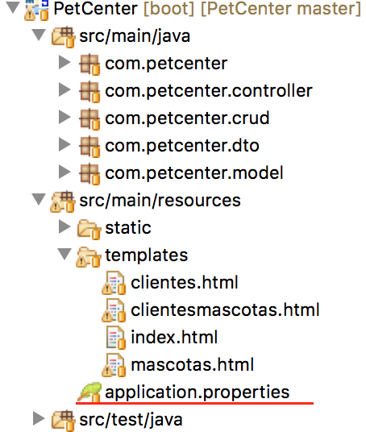

# PetCenter
Un proyecto hecho con Spring Framework

Herramienta de desarrollo: [Spring Tool Suite](https://spring.io/tools/sts)

El nivel de seguridad usa la siguiente configuracion

security.user.name=root

security.user.password=admin

security.basic.enabled=true

La aplicación utiliza conexion a base de datos con los siguientes parametros

spring.datasource.url=jdbc:mysql://localhost:8889/bd_PetCenter

spring.datasource.username=root

spring.datasource.password=root

spring.datasource.driver-class-name=com.mysql.jdbc.Driver

